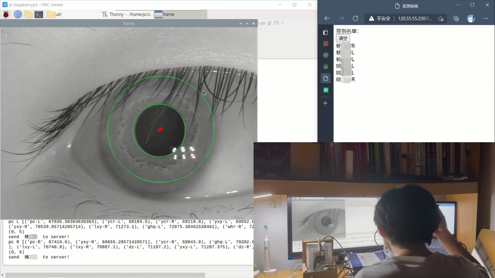
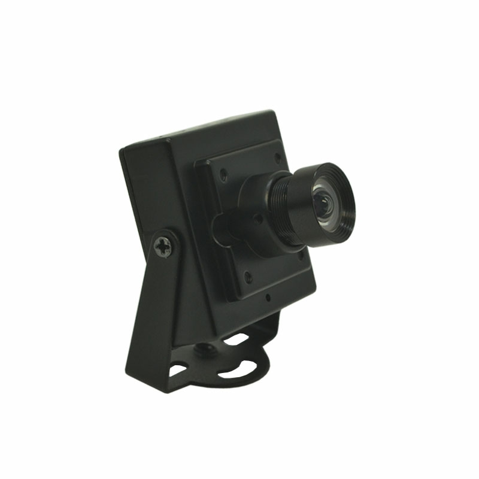
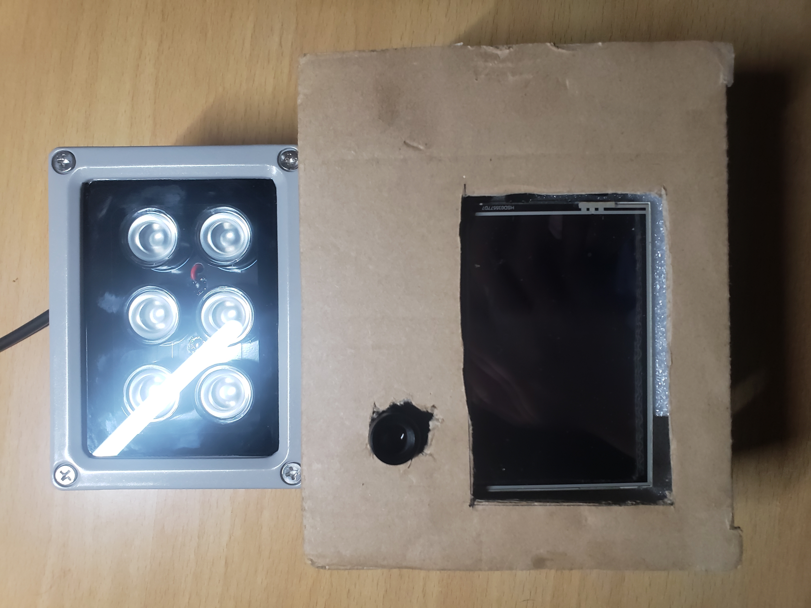
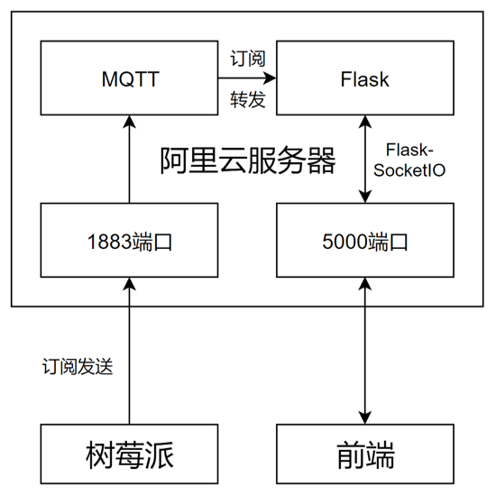

## 基于虹膜特征识别的简易签到系统

---

#### 1. 项目结构

* util：核心工具包
    * config.py：文件夹目录配置
    * innerCircle.py：虹膜内圆检测
    * outerCircle.py：虹膜外圆检测
    * normalize.py：虹膜区域规范化
    * feature.py：提取虹膜特征
    * contrast.py：虹膜特征比对
  
* photo：虹膜图片数据集

* feature：保存生成的虹膜特征数据集，与photo一一对应

* iris-web：签到系统web端
  
* takePhoto.py：采集虹膜图片

* run.py：虹膜采集识别

* mqtt.py：测试服务器连接

* demo.ipynb：核心方法调用示例
  
#### 2. 使用方法

首先使用takePhoto.py采集虹膜数据集，按p键拍摄，再次按p保存到/photo目录中，如果不满意按r重拍，按b退出拍摄。

注意：图片序号每次从1开始一次增大，多次运行会导致覆盖，需要拍摄后手动分类移动，每个人的左右眼虹膜不同。

虹膜采集好后按/photo中的目录格式分类，运行demo.ipynb中的第四段代码，提取数据库中所有图片的特征并保存到/feature中。

然后使用run.py拍摄待检测者的虹膜，按p键拍摄，再次按p检测，如果不满意按r重拍，按b退出拍摄。

#### 3. 核心算法示例

参考demo.ipynb中的代码

#### 4. 硬件系统与签到系统结构

选用焦距5.0mm可视角度65°的USB红外摄像头（手动旋转镜头调焦），以及12V红外LED补光灯。

